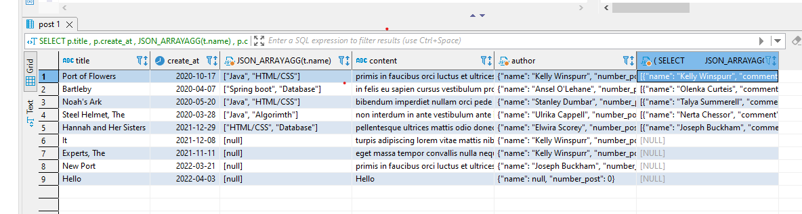

## Sử dụng database blog, thực hiện lấy thông tin cho một bài viết gồm tiêu đề, ngày viết, tag, nội dung bài, người viết bài (tên, số lượng bài đã viết), bình luận(người bl, thời gian bình luận, nội dung)
```sql
SELECT p.title , p.create_at , JSON_ARRAYAGG(t.name)  , p.content , 
JSON_OBJECT('name', a.name ,'number_post',
		(SELECT COUNT(p1.id) 
		FROM post p1 
		WHERE p1.id_author = a.id)) AS author,
		( SELECT 
         JSON_ARRAYAGG(JSON_OBJECT('name',
		(SELECT a1.name
		FROM author a1 
		WHERE a1.id = d.id_author),
		'creat_at',d.create_at,'comment',d.comment))
		FROM discuss d 
		WHERE d.id_post = p.id 
)
FROM post p 
LEFT JOIN post_tag pt ON pt.id_post = p.id 
LEFT JOIN tag t ON pt.id_tag = t.id 
LEFT JOIN author a ON p.id_author = a.id 
GROUP BY p.id  
```

