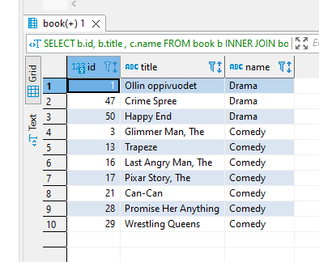
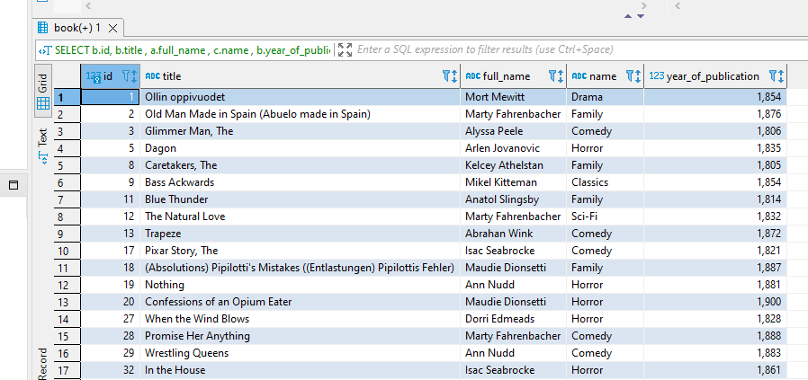
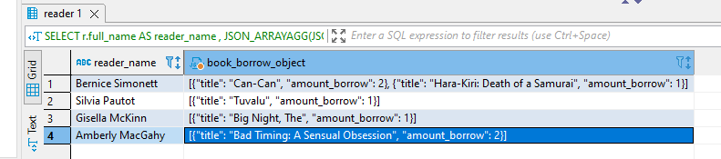
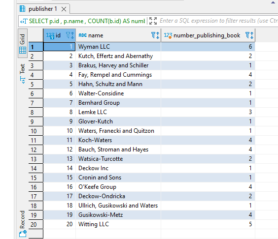

# Truy vấn database.

## 1.Lấy ra thông tin tất cả các quyển sách thuộc thể loại comedy hoặc drama
```sql
SELECT b.id, b.title  , c.name 
FROM book b 
INNER JOIN book_category bc ON bc.id_book = b.id
INNER JOIN category c ON bc.id_category = c.id 
WHERE c.name LIKE  'comedy'
OR c.name LIKE 'drama'  
```



## 2.Lấy ra id_book, title, author, category của quyển sách được xuất bản từ năm 1800 đến 1900

```sql
SELECT b.id, b.title  , a.full_name , c.name ,  b.year_of_publication
FROM book b 
INNER JOIN book_category bc ON bc.id_book = b.id
INNER JOIN category c ON bc.id_category = c.id 
INNER JOIN book_author ba ON ba.id_book = b.id 
INNER JOIN author a ON ba.id_author = a.id
WHERE b.year_of_publication BETWEEN 1800 AND 1900
```



## 3.Lấy ra thông tin những độc giả vẫn chưa trả sách

```sql
SELECT r.full_name  AS reader_name ,
JSON_ARRAYAGG(JSON_OBJECT('amount_borrow',bbi.amount - bbi.amount_return ,'title',b.title))
AS book_borrow_object
FROM reader r 
INNER JOIN borrow_back bb ON bb.id_reader = r.id 
INNER JOIN borrow_back_item bbi ON bbi.id_borrow = bb.id 
INNER JOIN book b ON bbi.id_book = b.id 
WHERE bbi.status LIKE 'incomplete'
GROUP BY r.id
```



## 4.Lấy ra thông tin các quyển sách vẫn chưa được trả

```sql
SELECT b.id, b.title , (bbi.amount - bbi.amount_return) AS book_borrow , r.full_name 
FROM book b
INNER JOIN borrow_back_item bbi ON b.id = bbi.id_book 
INNER JOIN borrow_back bb ON bbi.id_borrow = bb.id 
INNER JOIN reader r ON bb.id_reader = r.id
WHERE bbi.status LIKE 'incomplete'
```


## 5.Đếm số sách dựa theo nhà xuất bản

```sql
SELECT p.id , p.name , COUNT(b.id) AS number_publishing_book
FROM publisher p 
INNER JOIN book b ON b.id_publisher = p.id
GROUP BY p.id
```

