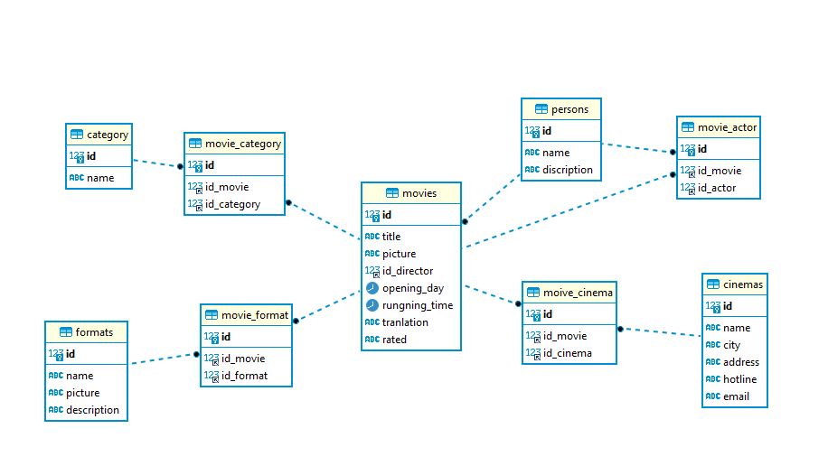
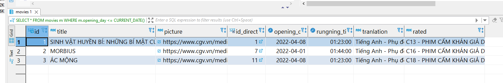
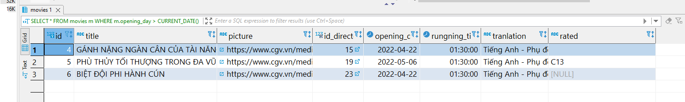
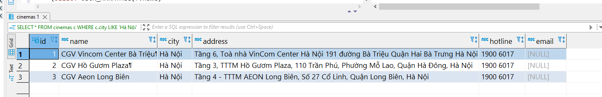
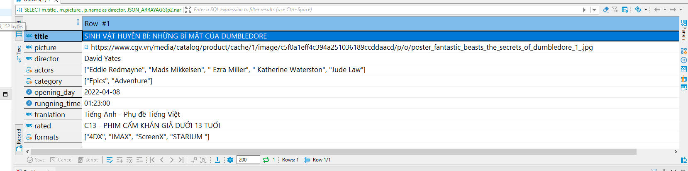

# Bài tập lớn tạo database quản lý phim

## 1.Tạo data base

```sql
CREATE DATABASE movie_manager
```

## 2.Tạo các bảng thành phần.
### 2.1.Tạo bảng persons để lưu trữ thông tin diễn viên và đạo diễn.
```sql
CREATE TABLE persons(
	id int primary key auto_increment,
	name varchar(255) not null,
	discription text default null
)
```

### 2.2.Tạo bảng thể loại phim.
```sql
CREATE TABLE category (
	id int primary key auto_increment,
	name varchar(255) not null
)
```

### 2.3.Tạo bảng rạp chiếu phim.
```sql
CREATE TABLE cinemas (
	id int primary key auto_increment,
   	name varchar(255) not null,
   	city varchar(255) not null,
   	address text not null,
   	hotline varchar(255) not null,
   	email varchar(255) default null
)
```

### 2.4.Tạo bảng format phim.
```sql
CREATE TABLE formats(
	id int primary key auto_increment,
	name varchar(255),
	picture text default null,
	description text default null
)
```

### 2.5.Tạo bảng movies.
```sql
CREATE TABLE movies (
	id int primary key auto_increment,
	title varchar(255) not null,
	picture text default null,
	id_director int not null,
	opening_day date not null,
	rungning_time time(0) not null,
	tranlation varchar(255) default null,
	rated varchar(255) default null,
	FOREIGN KEY (id_director) REFERENCES persons(id)
)
```

### 2.6.Tạo bảng trung gian movie_actor.
```sql
CREATE TABLE movie_actor (
	id int primary key auto_increment,
   	id_movie int not null,
   	id_actor int not null,
   	foreign key (id_movie) references movies(id),
   	foreign key (id_actor) references persons(id)
)
```

### 2.7. Tạo bảng trung gian movie_category.
```sql
CREATE TABLE movie_actor (
	id int primary key auto_increment,
   	id_movie int not null,
   	id_actor int not null,
   	foreign key (id_movie) references movies(id),
   	foreign key (id_actor) references persons(id)
)
```

### 2.8. Tạo bảng trung gian movie_cinema
```sql
-- Sai chính tả movie
CREATE TABLE moive_cinema ( 
   	id int primary key auto_increment,
   	id_movie int not null,
   	id_cinema int not null,
   	foreign key (id_movie) references movies(id),
   	foreign key (id_cinema) references cinemas(id)  	
)
```

### 2.9. Tạo bảng trung gian movie_format.
```sql
CREATE TABLE movie_format(
	id int primary key auto_increment,
	id_movie int not null,
   	id_format int not null,
   	foreign key (id_movie) references movies(id),
   	foreign key (id_format) references formats(id)
)
```

### Diagram.



## 3.Truy vấn dữ liệu.

### 3.1. Lấy thông tin các phim đang chiếu.
```sql
SELECT *
FROM movies m 
WHERE m.opening_day <= CURRENT_DATE()
```



### 3.2 Lấy thông tin các phim sắp chiếu.
```sql
SELECT *
FROM movies m 
WHERE m.opening_day > CURRENT_DATE() 
```



### 3.3. Lấy thông tin các rap chiếu phim ở Hà Nội.
```sql
SELECT *
FROM cinemas c 
WHERE c.city LIKE 'Hà Nội' 
```



### 3.4. Lấy thông tin của một bộ phim đang chiếu gồm các thông tin sau: Tên phim, ảnh, đạo diễn, diễn viên, thể loại, khởi chiếu, thời lượng, ngôn ngữ, rated, định dạng (3d, 4d).
```sql
SELECT m.title , m.picture , p.name as director, JSON_ARRAYAGG(p2.name) as actors,
	( SELECT JSON_ARRAYAGG(c.name)  
	FROM movies m 
	INNER JOIN persons p ON p.id = m.id_director 
	INNER JOIN movie_category mc ON mc.id_movie = m.id 
	INNER JOIN category c On c.id = mc.id_category 
	WHERE m.id =1 ) as category,
m.opening_day , m.rungning_time , m.tranlation ,m.rated ,
	(SELECT JSON_ARRAYAGG(f.name)
	FROM movies m 
	INNER JOIN persons p ON p.id = m.id_director  
	INNER JOIN movie_format mf ON mf.id_movie = m.id 
	INNER JOIN formats f On mf.id_format = f.id 
	WHERE m.id =1)  as formats 
FROM movies m 
INNER JOIN persons p ON p.id = m.id_director 
INNER JOIN movie_actor ma ON ma.id_movie = m.id 
INNER JOIN persons p2 ON p2.id = ma.id_actor  
WHERE m.id =1
```


